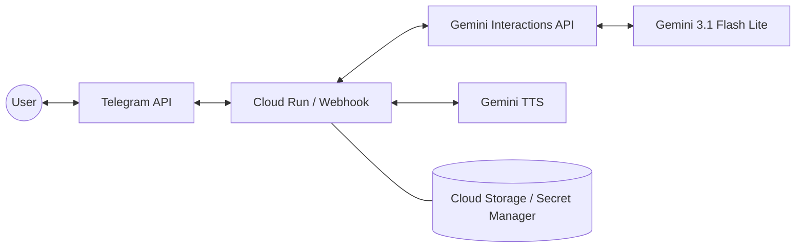

# PRD: Gemini 3.1 Telegram Bot (Voice & Text)

## 1. Overview
The goal of this project is to build a high-performance, cost-efficient Telegram bot that leverages the **Gemini 3.1 Flash Lite** model for multimodal interaction. The bot will support both text and voice inputs and can optionally respond with voice messages using **Gemini TTS**.

## 2. Target Audience
- Users seeking a low-latency AI assistant on Telegram.
- Users who prefer voice-based interactions for productivity or accessibility.

## 3. User Stories
- **US.1**: As a user, I want to send a text message and receive an intelligent text response.
- **US.2**: As a user, I want to send a voice note and have the bot understand my intent and context.
- **US.3**: As a user, I want the bot to reply with a voice message (Gemini TTS) so I can listen to responses on the go.
- **US.4**: As a user, I want the bot to be fast and responsive.

## 4. Functional Requirements

### 4.1 Telegram Integration
- **Interaction Model**: Use Telegram Webhooks (Interactions API) for real-time message handling.
- **Message Types**: Support `text` and `voice` (compressed .ogg/opus) messages.
- **Commands**: 
  - `/start`: Initialize the bot and explain capabilities.
  - `/voice on|off`: Toggle voice responses.

### 4.2 AI Processing (Gemini 3.1 Flash Lite)
- **Model**: `gemini-3.1-flash-lite-preview`.
- **Input Handling**: 
  - Text: Direct pass-through.
  - Voice: Download the `.ogg` file from Telegram, convert/upload to Gemini API (or pass as bytes if supported by the SDK) for direct audio reasoning.
- **System Instructions**: Define the bot's persona (helpful, concise).

### 4.3 Voice Synthesis (Gemini TTS)
- **Model**: `gemini-2.5-flash-tts` or `gemini-2.5-flash-lite-preview-tts`.
- **Capability**: Convert the text response from Gemini 3.1 into a `.wav` or `.mp3` file.
- **Tone/Style**: Use natural-sounding voices (e.g., "Kore" or "Aoede").

### 4.4 Deployment & Infrastructure
- **Platform**: Google Cloud Run.
- **Scaling**: Auto-scale to zero when not in use to minimize costs.
- **Storage**: Use secret manager for Telegram Bot Token and Google Cloud API Keys.

## 5. Technical Architecture

### 5.1 Data Flow (Voice Input)
1. User sends voice message to Telegram Bot.
2. Telegram sends a webhook POST request to Cloud Run.
3. Cloud Run fetches the voice file URL from Telegram and downloads it.
4. Cloud Run sends the audio data + prompt to `gemini-3.1-flash-lite-preview`.
5. Gemini returns a text response.
6. (If enabled) Cloud Run sends the text response to Gemini TTS.
7. Cloud Run sends the result (text or voice) back to Telegram.

## 6. Non-Functional Requirements
- **Latency**: End-to-end response (text-to-text) < 2 seconds; (voice-to-voice) < 5 seconds.
- **Cost**: Minimize Google Cloud costs by using Flash Lite and scale-to-zero.
- **Security**: All API keys and bot tokens must be stored in Google Cloud Secret Manager.

## 7. Success Metrics
- **Response Time**: Average time to reply.
- **User Engagement**: Number of active users and messages per day.
- **Voice Usage**: Percentage of interactions using voice input/output.
- **Cost per Interaction**: Monitoring billing via Cloud Console.
